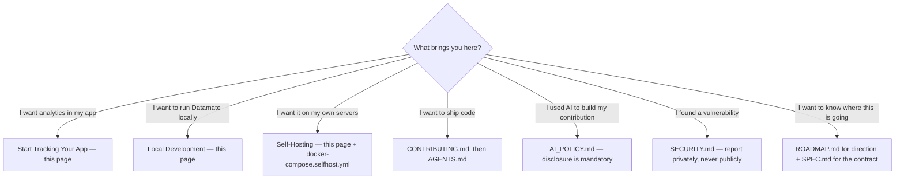
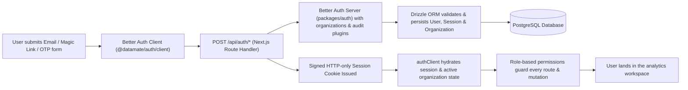
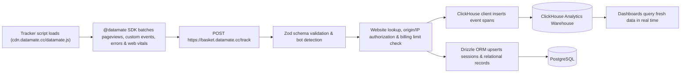
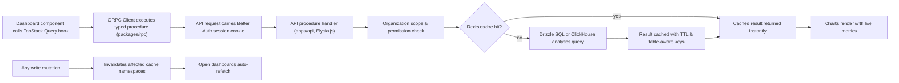
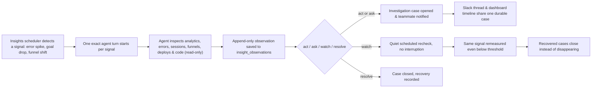
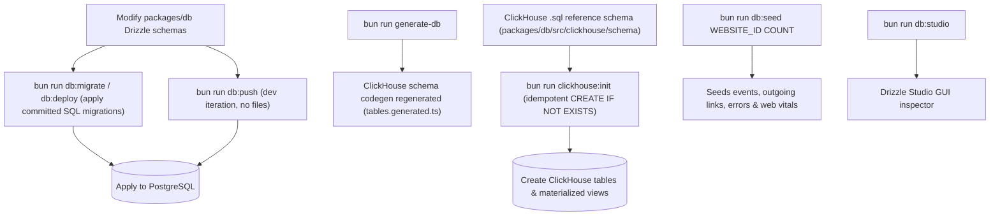
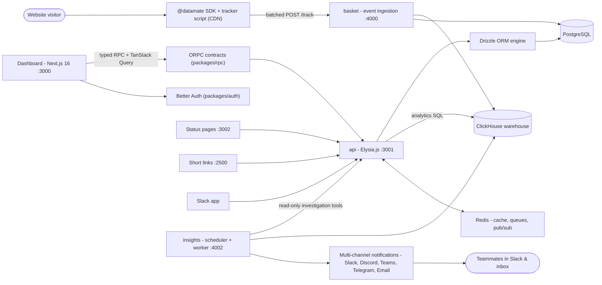

```text
██████╗  █████╗ ████████╗ █████╗ ███╗   ███╗ █████╗ ████████╗███████╗
██╔══██╗██╔══██╗╚══██╔══╝██╔══██╗████╗ ████║██╔══██╗╚══██╔══╝██╔════╝
██║  ██║███████║   ██║   ███████║██╔████╔██║███████║   ██║   █████╗
██║  ██║██╔══██║   ██║   ██╔══██║██║╚██╔╝██║██╔══██║   ██║   ██╔══╝
██████╔╝██║  ██║   ██║   ██║  ██║██║ ╚═╝ ██║██║  ██║   ██║   ███████╗
╚═════╝ ╚═╝  ╚═╝   ╚═╝   ╚═╝  ╚═╝╚═╝     ╚═╝╚═╝  ╚═╝   ╚═╝   ╚══════╝
```

[](LICENSE)
[](https://www.typescriptlang.org/)
[](https://bun.sh/)
[](https://nextjs.org/)
[](https://reactjs.org/)
[](https://tailwindcss.com/)
[](https://elysiajs.com/)
[](https://www.postgresql.org/)
[](https://clickhouse.com/)
[](https://redis.io/)

[](https://github.com/datamate-analytics/Datamate/actions)
[](https://github.com/datamate-analytics/Datamate/actions)
[](SECURITY.md)
[](https://vercel.com/oss)
[](LICENSE)

---

> [!NOTE]
> **Datamate** is a privacy-first, open-source product analytics platform. It combines real-time traffic monitoring, funnels, goals, error tracking, Web Vitals, uptime checks, and short links with an **autonomous LLM intelligence layer** that detects metrics anomalies, investigates root causes, and notifies teams.

---

## ✨ Features

| Feature                        | Description                                                               | Tech Highlight                               |
| :----------------------------- | :------------------------------------------------------------------------ | :------------------------------------------- |
| 📊 **Real-time Traffic**       | Live visitors, pageviews, sessions, geolocation, browsers, devices        | ClickHouse sub-second columnar query         |
| 🎯 **Product Funnels & Goals** | Multi-step drop-off analysis, conversion tracking & custom properties     | In-memory aggregations & custom events       |
| 🛡️ **App Health & Quality**    | Stacktrace error tracking, Core Web Vitals (LCP, CLS, INP), uptime checks | Automatic error grouping & alert triggers    |
| 🔗 **Short Links & Growth**    | UTM analytics, short link redirection & click counts                      | Edge-cached redirect engine                  |
| 🤖 **Autonomous Intelligence** | Anomaly detection worker, LLM investigation agent & Slack case sync       | Multi-provider AI (OpenAI, Groq, OpenRouter) |
| 🔐 **Enterprise Security**     | Organization tenancy, RBAC permissions, zero-cookie option, hashed IPs    | GDPR / CCPA compliant by design              |

---

## 📡 Start Tracking Your App

Integration takes under **2 minutes**. Pick your stack:

### ⚛️ React / Next.js (`tsx`)

```tsx
import { Datamate } from "@datamate/sdk/react";

export default function RootLayout({
  children,
}: {
  children: React.ReactNode;
}) {
  return (
    <html lang="en">
      <head>
        <Datamate
          clientId={process.env.NEXT_PUBLIC_DATAMATE_CLIENT_ID!}
          trackWebVitals
          trackErrors
          enableBatching
        />
      </head>
      <body>{children}</body>
    </html>
  );
}
```

### 🟢 Vue 3 / Nuxt (`ts`)

```ts
import { createApp } from "vue";
import { createDatamate } from "@datamate/sdk/vue";
import App from "./App.vue";

const app = createApp(App);
app.use(
  createDatamate({
    clientId: import.meta.env.VITE_DATAMATE_CLIENT_ID,
    trackWebVitals: true,
    trackErrors: true,
  }),
);
app.mount("#app");
```

### 🌐 Vanilla JS / HTML Script (`html`)

```html
<script
  async
  src="https://cdn.datamate.cc/datamate.js"
  data-client-id="YOUR_CLIENT_ID"
  data-track-web-vitals="true"
  data-track-errors="true"
></script>
```

### ⚡ Custom Event Ingestion (`ts`)

```ts
import { track } from "@datamate/sdk";

track("signup_completed", {
  method: "github",
  plan: "enterprise",
  value: 99.0,
});
```

### 🟢 Server-Side Ingestion - Node.js (`ts`)

```ts
import { Datamate } from "@datamate/sdk/node";

const client = new Datamate({
  apiKey: process.env.DATAMATE_API_KEY!,
  websiteId: process.env.DATAMATE_WEBSITE_ID,
});

await client.track({
  name: "payment_processed",
  eventId: `pay-${paymentId}`, // ⚡ Deduplicated idempotently
  properties: { amount: 149.99, currency: "USD" },
});
await client.flush();
```

### 📱 iOS / macOS - Swift (`swift`)

```swift
import DatamateSDK

@main
struct MyApp: App {
    init() {
        Datamate.configure(clientId: "YOUR_CLIENT_ID", trackErrors: true)
    }
    var body: some Scene {
        WindowGroup {
            ContentView().onAppear {
                Datamate.track(name: "app_launched", properties: ["os": "iOS"])
            }
        }
    }
}
```

### 🐍 Python Backend (`python`)

```python
import requests

requests.post(
    "https://basket.datamate.cc/track",
    headers={"X-Datamate-Client-Id": "YOUR_CLIENT_ID"},
    json={
        "type": "event",
        "name": "model_inference_completed",
        "properties": {"latency_ms": 142, "tokens": 512},
    },
)
```

### 📡 Direct cURL API (`bash`)

```bash
curl -X POST https://basket.datamate.cc/track \
  -H "Content-Type: application/json" \
  -H "X-Datamate-Client-Id: YOUR_CLIENT_ID" \
  -d '{"type":"event","name":"api_ping","properties":{"env":"prod"}}'
```

---

### Not sure where to start?



Every path ends in a section on this page or a document in the repository root — no dead ends.

## 🔧 How It Works

### Authentication & Session Flow



### Live Analytics Event Ingestion Flow



### Typed Query Layer & Caching Flow



### Intelligence Investigation Flow



### Database & Migration CLI Flow



### Architecture Topology Overview



---

## 💾 Storage Engine & Data Map

| Storage Store                        | Managed Data                                    | Purpose                                    |
| :----------------------------------- | :---------------------------------------------- | :----------------------------------------- |
| 🗄️ **PostgreSQL 17** _(Drizzle ORM)_ | Users, Orgs, Websites, API Keys, Settings       | Relational ACID transactions               |
| ⚡ **ClickHouse 25.5** _(Columnar)_  | Events, Pageviews, Errors, Web Vitals, Sessions | Instant aggregations over billions of rows |
| 🔑 **Redis 7** _(ioredis & BullMQ)_  | Query Cache, BullMQ Queues, Pub/Sub             | Sub-millisecond reads & async workers      |

---

## ⚡ Code Examples Deep Dive

### 1. Type-Safe ORPC Definition (`packages/rpc`)

```ts
import { z } from "zod";
import { trackedProcedure } from "../middleware/auth";

export const getWebsiteOverview = trackedProcedure
  .input(
    z.object({
      websiteId: z.string(),
      period: z.enum(["24h", "7d", "30d"]),
    }),
  )
  .output(
    z.object({
      pageviews: z.number(),
      visitors: z.number(),
      bounceRate: z.number(),
    }),
  )
  .query(async ({ input, ctx }) => {
    return ctx.services.analytics.getOverview(input.websiteId, input.period);
  });
```

### 2. Drizzle PostgreSQL Schema (`packages/db`)

```ts
import { pgTable, text, timestamp, boolean } from "drizzle-orm/pg-core";
import { createId } from "@datamate/shared";

export const websites = pgTable("websites", {
  id: text("id")
    .primaryKey()
    .$defaultFn(() => createId("ws")),
  organizationId: text("organization_id").notNull(),
  name: text("name").notNull(),
  domain: text("domain").notNull(),
  public: boolean("public").default(false).notNull(),
  createdAt: timestamp("created_at").defaultNow().notNull(),
});
```

### 3. ClickHouse SQL Table Schema (`packages/db`)

```sql
CREATE TABLE IF NOT EXISTS analytics.events (
  website_id UUID,
  session_id UUID,
  event_name LowCardinality(String),
  timestamp DateTime64(3, 'UTC'),
  properties String JSON
) ENGINE = ReplacingMergeTree()
ORDER BY (website_id, event_name, timestamp, session_id);
```

### 4. Elysia.js RPC App (`apps/api`)

```ts
import { Elysia } from "elysia";
import { fetchRequestHandler } from "@orpc/server/fetch";
import { appRouter } from "@datamate/rpc";

export const app = new Elysia()
  .all("/rpc/*", ({ request }) =>
    fetchRequestHandler({ router: appRouter, request, prefix: "/rpc" }),
  )
  .listen(3001);
```

---

## 🚀 Local Development

### 1-Step Quick Start

```bash
bun run setup
```

### Manual Setup

```bash
# Clone & Install
git clone https://github.com/GiorgiKavtaradze-prog/datamate.git
cd datamate && bun install

# Environment & Infrastructure
cp .env.example .env
docker compose up -d

# Initialize Databases & SDK
bun run db:push
bun run clickhouse:init
bun run sdk:build

# Launch App (Dashboard + API)
bun run dev:dashboard
```

### 🛠️ CLI Commands Cheat Sheet

```bash
bun run dev:dashboard     # Start Dashboard (:3000) & API (:3001)
bun run build             # Build all apps & packages
bun run check-types       # Strict TypeScript typecheck
bun run lint              # Biome linter check
bun run db:push           # Apply PostgreSQL schema changes
bun run clickhouse:init   # Create ClickHouse analytics tables
bun run db:studio         # Open Drizzle GUI database browser
bun run test              # Run unit & integration tests
```

---

## 🏠 Self-Hosting

Deploy with Docker Compose using prebuilt images:

```bash
# 1. Environment & Infrastructure
cp .env.example .env
docker compose -f docker-compose.selfhost.yml up -d postgres clickhouse redis

# 2. Database Init (First run)
bun run db:push && bun run clickhouse:init

# 3. Start Backend Services
docker compose -f docker-compose.selfhost.yml up -d
```

### Services & Ports

- 📊 **Dashboard**: `http://localhost:3000`
- ⚡ **API Server**: `http://localhost:3001`
- 📥 **Event Ingestion**: `http://localhost:4000`
- 🤖 **Insights Worker**: `http://localhost:4002`
- 🔗 **Short Links**: `http://localhost:2500`

---

## 🧪 Testing

```bash
bun run test             # Unit & integration tests
bun run test:watch       # Test watcher mode
```

---

## 🤝 Contributing & AI Policy

- Review [`CONTRIBUTING.md`](CONTRIBUTING.md) before opening a PR.
- **AI Policy (`AI_POLICY.md`):** All AI assistance must be explicitly disclosed in PR descriptions.

---

## 🔒 Security

Found a vulnerability? Report privately via [`SECURITY.md`](SECURITY.md) or email `security@datamate.cc`. Do not open public issues.

---

## 💬 Support & Community

- 💬 **Discord**: Join the [Datamate Discord Community](https://discord.gg/JTk7a38tCZ)
- 🐦 **Twitter / X**: Follow [@trydatamate](https://twitter.com/trydatamate)
- 🐛 **Bug Reports**: Open an issue on [GitHub Issues](https://github.com/GiorgiKavtaradze-prog/Datamate/issues)

---

## 📄 License

This project is licensed under the **MIT License**. See the [`LICENSE`](LICENSE) file for details.

Copyright © 2026 **GiorgiKavtaradze**
