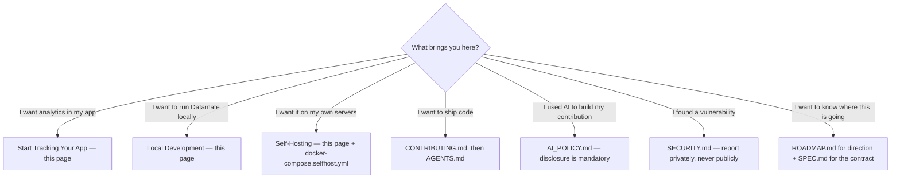
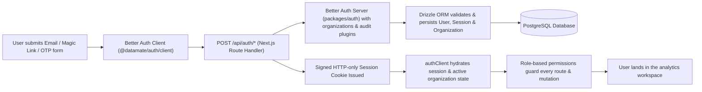
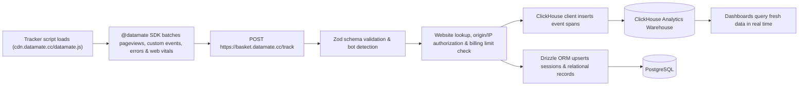
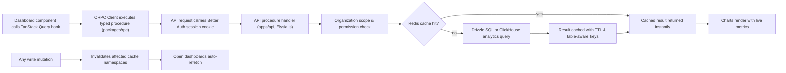
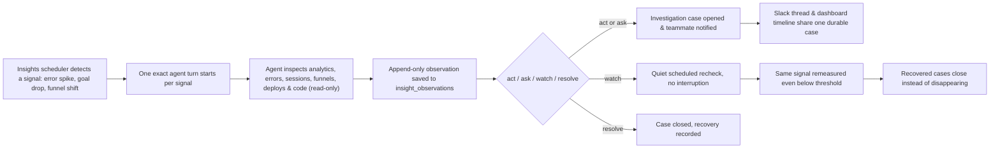
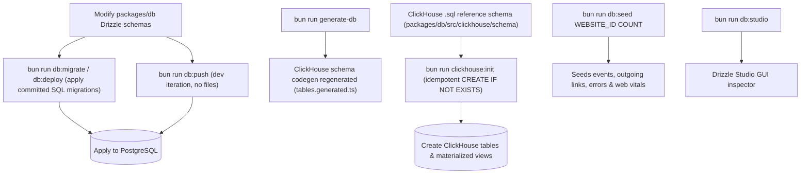

```text
██████╗  █████╗ ████████╗ █████╗ ███╗   ███╗ █████╗ ████████╗███████╗
██╔══██╗██╔══██╗╚══██╔══╝██╔══██╗████╗ ████║██╔══██╗╚══██╔══╝██╔════╝
██║  ██║███████║   ██║   ███████║██╔████╔██║███████║   ██║   █████╗
██║  ██║██╔══██║   ██║   ██╔══██║██║╚██╔╝██║██╔══██║   ██║   ██╔══╝
██████╔╝██║  ██║   ██║   ██║  ██║██║ ╚═╝ ██║██║  ██║   ██║   ███████╗
╚═════╝ ╚═╝  ╚═╝   ╚═╝   ╚═╝  ╚═╝╚═╝     ╚═╝╚═╝  ╚═╝   ╚═╝   ╚══════╝
```

[](LICENSE)
[](https://www.typescriptlang.org/)
[](https://nextjs.org/)
[](https://reactjs.org/)
[](https://turbo.build/repo)
[](https://bun.sh/)
[](https://tailwindcss.com/)

[](https://github.com/datamate-analytics/Datamate/actions/workflows/coverage.yml)
[](https://github.com/datamate-analytics/Datamate/actions/workflows/security.yml)
[](https://github.com/datamate-analytics/Datamate/actions/workflows/dependencies.yml)

[](https://vercel.com/oss)

[](LICENSE)

> **Datamate** is a privacy-first, open-source analytics platform for teams that want to deeply understand their products — without invading their users' privacy.

It combines real-time traffic analytics, funnels, goals, error tracking, Web Vitals, uptime monitoring, and short links with an intelligence layer that detects material changes, investigates them against your own data, and turns findings into durable work that stays open until resolved.

## ✨ Features

| Area                | Capabilities                                                                                                                       |
| ------------------- | ---------------------------------------------------------------------------------------------------------------------------------- |
| **Analytics**       | Real-time dashboard, pageviews & screen views, sessions, referrers, devices, geolocation                                           |
| **Product insight** | Funnels, goals & conversion tracking, custom events, outgoing-link tracking                                                        |
| **Quality**         | Error tracking, Web Vitals, uptime monitors, public status pages                                                                   |
| **Growth tools**    | Short links with full click analytics                                                                                              |
| **Intelligence**    | Automated signal detection, agentic investigation, durable cases across Dashboard & Slack                                          |
| **Platform**        | Multi-tenant organizations with role-based permissions, type-safe RPC API, data export, GDPR-friendly by design, encrypted secrets |

On the roadmap: advanced visualization builder, live streaming updates, custom metric definitions, cohort analysis, and A/B testing — see [`ROADMAP.md`](ROADMAP.md) for direction and [`SPEC.md`](SPEC.md) for the product contract.

## 📋 Jump To

|                                                         |                                                      |                                             |
| ------------------------------------------------------- | ---------------------------------------------------- | ------------------------------------------- |
| [Features](#-features)                                  | [Start Tracking Your App](#-start-tracking-your-app) | [Repository Guide](#-repository-guide)      |
| [How It Works](#-how-it-works)                          | [Architecture](#-architecture)                       | [Tech Stack](#-tech-stack)                  |
| [Local Development](#-local-development)                | [Self-Hosting](#-self-hosting)                       | [Testing](#-testing)                        |
| [Contributing](#-contributing) · [Security](#-security) | [FAQ](#-faq)                                         | [Support](#-support) · [License](#-license) |

## 📡 Start Tracking Your App

Adding analytics takes about two minutes. Create a website in the Dashboard, copy its client ID, then pick your integration:

**React / Next.js** — install the SDK and mount the component at your app root:

```tsx
import { Datamate } from "@datamate/sdk/react";

export default function RootLayout({
  children,
}: {
  children: React.ReactNode;
}) {
  return (
    <html lang="en">
      <head />
      <Datamate
        clientId={process.env.NEXT_PUBLIC_DATAMATE_CLIENT_ID!}
        trackWebVitals
        trackErrors
        enableBatching
      />
      <body>{children}</body>
    </html>
  );
}
```

**Any other stack (vanilla / CMS / tag managers)** — load the tracker script straight from CDN:

```html
<script
  async
  src="https://cdn.datamate.cc/datamate.js"
  data-client-id="YOUR_CLIENT_ID"
></script>
```

**Custom events anywhere in your app:**

```ts
import { track } from "@datamate/sdk";

track("signup_completed", { method: "google", plan: "pro" });
```

**Server-side events (Node.js / cron / webhooks)** — authenticate with your API key and always `flush()` before the process exits:

```ts
import { Datamate } from "@datamate/sdk/node";

const client = new Datamate({
  apiKey: process.env.DATAMATE_API_KEY!,
  websiteId: process.env.DATAMATE_WEBSITE_ID,
  source: "backend",
});

await client.track({
  name: "job_completed",
  eventId: `job-${jobId}`, // ⚡ re-sends of the same eventId are deduplicated
  properties: { queue: "emails", total: 128 },
});
const result = await client.flush();
if (!result.success) console.error("Failed to flush analytics:", result.error);
```

> Vue/Nuxt components, server-side tracking (`@datamate/sdk/node`) with batching & `flush()`, feature flags, and a native Swift package are also available — see [`packages/sdk`](packages/sdk/README.md) and the full guides under [`apps/docs/content/docs/sdk`](apps/docs/content/docs/sdk/index.mdx).

## 📚 Repository Guide

| Document                                                     | What's inside                                           |
| ------------------------------------------------------------ | ------------------------------------------------------- |
| [`CONTRIBUTING.md`](CONTRIBUTING.md)                         | Contribution workflow, PR standards, commit conventions |
| [`AI_POLICY.md`](AI_POLICY.md)                               | Formal rules for disclosing AI assistance               |
| [`SECURITY.md`](SECURITY.md)                                 | Responsible vulnerability disclosure                    |
| [`ROADMAP.md`](ROADMAP.md) · [`SPEC.md`](SPEC.md)            | Product direction & product contract                    |
| [`AGENTS.md`](AGENTS.md)                                     | Coding conventions for AI coding agents in this repo    |
| [`.env.example`](.env.example)                               | Reference list of every supported environment variable  |
| [`apps/docs`](apps/docs/content/docs/index.mdx)              | Full product, API & SDK documentation (Fumadocs site)   |
| [`docker-compose.selfhost.yml`](docker-compose.selfhost.yml) | Production self-hosting compose file                    |

### Not sure where to start?



Every path ends in a section on this page or a document in the repository root — no dead ends.

## 🔧 How It Works

### Authentication & Session Flow



### Live Analytics Event Ingestion Flow



### Typed Query Layer & Caching Flow



### Intelligence Investigation Flow



### Database & Migration CLI Flow



### Architecture Topology Overview


---

## 🏗️ Architecture

### Repository layout

| Path                                                                                                         | Purpose                                                            |
| ------------------------------------------------------------------------------------------------------------ | ------------------------------------------------------------------ |
| `apps/dashboard`                                                                                             | Next.js 16 web application (React 19, TailwindCSS 4)               |
| `apps/api`                                                                                                   | Elysia.js RPC/API server (port 3001)                               |
| `apps/basket`                                                                                                | High-throughput analytics event ingestion (port 4000)              |
| `apps/insights`                                                                                              | Investigation scheduler & worker (port 4002)                       |
| `apps/status`                                                                                                | Public status pages (port 3002)                                    |
| `apps/links`                                                                                                 | Short-link redirects & tracking (port 2500)                        |
| `apps/uptime`                                                                                                | Uptime monitoring checks                                           |
| `apps/cron`                                                                                                  | Scheduled jobs                                                     |
| `apps/slack`                                                                                                 | Slack app integration                                              |
| `apps/docs`                                                                                                  | Documentation site (Fumadocs)                                      |
| `apps/video`                                                                                                 | Remotion product video workspace                                   |
| `packages/rpc`                                                                                               | ORPC router — the type-safe API contract between dashboard and API |
| `packages/db`                                                                                                | Drizzle ORM schemas & clients (PostgreSQL + ClickHouse)            |
| `packages/auth`                                                                                              | Better-Auth integration & permission system                        |
| `packages/sdk`                                                                                               | Public analytics SDK (React, Vue, Node.js)                         |
| `packages/sdk-swift`                                                                                         | Native Swift package for Apple apps                                |
| `packages/tracker`                                                                                           | Lightweight client tracking script (`datamate.js`) served from CDN |
| `packages/cache`                                                                                             | Redis-backed Drizzle query caching                                 |
| `packages/redis`                                                                                             | Redis client, pub/sub, BullMQ queues                               |
| `packages/ui`                                                                                                | Shared design system                                               |
| `packages/validation`                                                                                        | Zod schemas                                                        |
| `packages/ai`                                                                                                | LLM integrations (OpenAI, Groq, OpenRouter)                        |
| `packages/services`                                                                                          | Cross-cutting business logic                                       |
| `packages/email`                                                                                             | Transactional email via Resend                                     |
| `packages/notifications`                                                                                     | Multi-channel alerting (Slack, Discord, Teams, Telegram…)          |
| `packages/shared` · `mapper` · `query` · `api-keys` · `encryption` · `env` · `migrate` · `devtools` · `test` | Shared types, utilities, and infrastructure                        |

### What lives where

Storage is split by access pattern — and every query in the codebase follows this map:

| Store                    | Owns                                                                                                                                   | Why it fits                                            |
| ------------------------ | -------------------------------------------------------------------------------------------------------------------------------------- | ------------------------------------------------------ |
| **PostgreSQL** (Drizzle) | Users, organizations, memberships, websites, settings, API keys, relational product state                                              | Transactions, referential integrity, row-level queries |
| **ClickHouse**           | Events, pageviews, sessions, custom events, errors, Web Vitals, outgoing-link clicks, insight observations & investigation projections | Columnar scans and aggregations over billions of rows  |
| **Redis**                | Query cache, BullMQ job queues, pub/sub fan-out                                                                                        | Sub-millisecond reads and durable async work           |

Rule of thumb: aggregating traffic over time → ClickHouse; identity, configuration, or durable product state → PostgreSQL through Drizzle + `@datamate/cache`.

## 💻 Tech Stack

| Layer                     | Technology                                                                           |
| ------------------------- | ------------------------------------------------------------------------------------ |
| Runtime & package manager | Bun 1.3.14+                                                                          |
| Frontend                  | Next.js 16 · React 19 · TailwindCSS 4 · Radix UI · Recharts · Jotai · TanStack Query |
| Backend                   | Elysia.js (Bun-native HTTP framework)                                                |
| API layer                 | ORPC (type-safe RPC with OpenAPI generation)                                         |
| Auth                      | Better-Auth                                                                          |
| Data                      | PostgreSQL 17 · ClickHouse 25.5 · Redis 7 · Drizzle ORM                              |
| Validation                | Zod 4                                                                                |
| Quality                   | Biome via Ultracite · Playwright · Turborepo                                         |

## 🚀 Local Development

### Prerequisites

- [Bun](https://bun.sh) 1.3.14+ and Node.js 20+
- Docker (for PostgreSQL, ClickHouse, and Redis)

### Setup

Prefer a guided experience? Run **`bun run setup`** — an interactive wizard that verifies prerequisites (Bun, Docker) and prepares your `.env`. Otherwise, follow the manual steps below.

```bash
# 1. Install dependencies
bun install

# 2. Configure environment
cp .env.example .env

# 3. Start infrastructure
docker compose up -d          # PostgreSQL, ClickHouse, Redis

# 4. Initialize databases
bun run db:push               # Push the PostgreSQL schema
bun run clickhouse:init       # Create the ClickHouse analytics schema

# 5. Build the public SDK (required once, and after any SDK change)
bun run sdk:build

# 6. Start developing
bun run dev:dashboard         # Dashboard + API (most common workflow)
```

Optionally seed realistic sample data for a website:

```bash
bun run db:seed <WEBSITE_ID> [EVENT_COUNT]   # default event count: 10,000
```

> All root scripts load `.env` automatically via a `dotenv --` prefix — always run them from the repository root.

### Common commands

| Command                                             | Description                                        |
| --------------------------------------------------- | -------------------------------------------------- |
| `bun run dev`                                       | Start all applications in development mode         |
| `bun run dev:dashboard`                             | Start the dashboard + API only                     |
| `bun run build`                                     | Production build of every app                      |
| `bun run lint` / `bun run format`                   | Lint / format with Ultracite (Biome)               |
| `bun run check-types`                               | Type-check the entire monorepo                     |
| `bun run test` / `test:watch`                       | Run all tests                                      |
| `bun run db:push`                                   | Apply schema changes directly (no migration files) |
| `bun run db:migrate` / `db:deploy`                  | Run / deploy migration files                       |
| `bun run db:studio`                                 | Open Drizzle Studio GUI                            |
| `bun run sdk:build`                                 | Build the SDK package                              |
| `bun run email:dev`                                 | Email template development server                  |
| `bun run setup`                                     | Interactive prerequisite check & `.env` wizard     |
| `bun run dev:insights` / `dev:status` / `dev:slack` | Run individual workspaces                          |
| `bun run test:coverage`                             | Run tests with coverage report                     |
| `bun run generate-db`                               | Regenerate ClickHouse schema codegen               |
| `bun run clean`                                     | Remove build artifacts and `node_modules`          |

## 🏠 Self-Hosting

Datamate can be self-hosted using Docker Compose. The repo includes two compose files:

| File                          | Purpose                                                                                  |
| ----------------------------- | ---------------------------------------------------------------------------------------- |
| `docker-compose.yaml`         | **Development only** — starts infrastructure (Postgres, ClickHouse, Redis) for local dev |
| `docker-compose.selfhost.yml` | **Production / self-hosting** — backend services from GHCR images                        |

### Quick Start

```bash
# 1. Configure environment
cp .env.example .env
# Edit .env — set IMAGE_TAG, URL-safe database/cache passwords, public URLs,
# BETTER_AUTH_SECRET, DATAMATE_ENCRYPTION_KEY, IP_HASH_SALT, and
# AI_GATEWAY_API_KEY. Make the local database URLs use the same credentials
# before running the initialization commands below.

# 2. Start databases and cache
docker compose -f docker-compose.selfhost.yml up -d postgres clickhouse redis

# 3. Initialize databases from the repo checkout (first run only)
bun install --frozen-lockfile
bun run db:push
bun run clickhouse:init

# 4. Start backend services
docker compose -f docker-compose.selfhost.yml up -d
```

Services started:

- **API** → `localhost:3001`
- **Basket** (event ingestion) → `localhost:4000`
- **Insights** (investigation worker) → `localhost:4002`
- **Links** (short links) → `localhost:2500`

All ports are configurable via env vars (`API_PORT`, `BASKET_PORT`, etc.). See the compose file comments for the full env var reference.

## 🧪 Testing

```bash
bun run test           # unit & integration tests across workspaces
bun run test:watch     # watch mode
```

Dashboard end-to-end tests use Playwright with an isolated per-run database — see [`apps/dashboard/test/e2e`](apps/dashboard/test/e2e) for the runner and standards.

## 🤝 Contributing

Contributions are welcome! Please read [`CONTRIBUTING.md`](CONTRIBUTING.md) before opening a pull request — note that the project has a formal [`AI_POLICY.md`](AI_POLICY.md) that requires disclosure of any AI assistance.

## 🔒 Security

Found a vulnerability? Please report it responsibly via [`SECURITY.md`](SECURITY.md) — do not open a public issue.

**What is Datamate?**
A privacy-first, open-source analytics platform covering traffic analytics, product funnels, quality signals (errors, Web Vitals, uptime), short links, and an agentic intelligence layer that investigates meaningful changes for you.

**What are the system requirements?**
Bun 1.3.14+, Node.js 20+, and Docker for the three backing stores. See [Local Development](#-local-development).

**Is it privacy-friendly?**
Privacy-first is a core design constraint, not a marketing flag: visitor IPs are salted and hashed before storage, third-party integration secrets are encrypted at rest, data export is built in, and self-hosting keeps every byte on infrastructure you control.

**Which frameworks does the SDK support?**
React / Next.js, Vue / Nuxt, Node.js server apps, a native Swift package for Apple platforms, and a plain CDN script for anything else (including Google Tag Manager).

**Can I contribute AI-assisted code?**
Yes — but all AI usage must be disclosed per [`AI_POLICY.md`](AI_POLICY.md). See [Contributing](#-contributing) before opening a pull request.

## 💬 Support

- [Discord community](https://discord.gg/JTk7a38tCZ)
- [@trydatamate on X/Twitter](https://twitter.com/trydatamate)
- [GitHub Issues](https://github.com/GiorgiKavtaradze-prog/Datamate/issues) for bug reports and feature requests

## 📄 License

This project is licensed under the MIT License. See [`LICENSE`](LICENSE) for details.

Copyright © 2026 GiorgiKavtaradze
