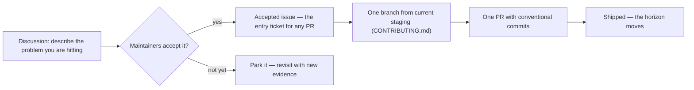

# Intelligence Roadmap

[`SPEC.md`](./SPEC.md) is the product contract. This is direction, not a promise.

## How to read this roadmap

| Horizon                | Meaning                            | Commitment                                          |
| ---------------------- | ---------------------------------- | --------------------------------------------------- |
| **Shipped foundation** | Live in production today           | Contract — see [`SPEC.md`](./SPEC.md)               |
| **Now**                | Actively being built               | High — this is funded work                          |
| **Next**               | Committed direction once Now lands | Medium — sequencing may shift                       |
| **Later**              | Exploration with clear intent      | Low — the problems are real, the solutions are open |
| **Not building**       | Explicit non-goals                 | Final — please don't open PRs for these             |

## How to influence this roadmap

The path from idea to shipped feature is deliberate:

Anything that contradicts **Not building** will be closed with a pointer to this file. AI-created PRs additionally require the accepted-issue reference per [`AI_POLICY.md`](AI_POLICY.md).

## Shipped foundation

- One signal enters one intelligence agent with shared analytics and read-only code/deploy tools; one `act | ask | watch | resolve` outcome is saved in the existing observation timeline. The old bounded classifier, repair lifecycle, duplicate evidence stack, and synthetic evaluator are gone.
- Each investigation keeps one signal's agent observations and human replies in one chronological case timeline.
- Dashboard, Slack, and MCP replies enter the same durable reply path, resume the same-signal case, re-check current data, and append the new outcome.
- Scheduled revisits remeasure the same error, goal, funnel, or metric even after it falls below the detector threshold; recovered cases close instead of disappearing.
- The generic agent exposes the same Insights brief and `list | get | reply` investigation path, and recurring Slack updates stay in the original case thread.
- The agent outcome controls delivery directly: `act` and `ask` notify, `watch` rechecks quietly, and `resolve` closes.

## Now

- Restore the Insights brief as a chronological view of agent observations while keeping investigations as the smaller durable work queue.
- Include improvements, recoveries, and useful `watch` outcomes in the brief without turning them into cases or Slack alerts.
- Use the read-only production shadow—not synthetic prose graders—until root cause, impact, next action, and verification are consistently useful.
- Preserve exact entity definitions and business meaning through detection, investigation, Slack, and the dashboard; research missing context before asking a teammate.
- During an investigation, propose missing goal or funnel meaning and capture it after user confirmation.

## Next

- Let a website run continue past the first useful signal, with a small cost cap and one independent agent turn per subject.
- Let the agent produce a patch and verification plan without write credentials.
- Have Datamate validate the patch, open one linked PR, and resume on review events.
- Verify the signal after merge; resolve or reopen the case.

## Later

- One-click telemetry, deploy, ad, support, CRM, and infrastructure connectors.
- Cross-source grouping when several signals share a root cause.
- Approved campaign, configuration, and infrastructure actions.
- Project memory and evals learned from accepted, rejected, and corrected work.

## Not building

- A second insight engine, evidence stack, or generic analytics chat.
- The old card framework, client-side narrative layer, or synthetic prose grader.
- A diagnosis rule engine or a subsystem per action type.
- Automatic mutation before investigation quality is proven.
